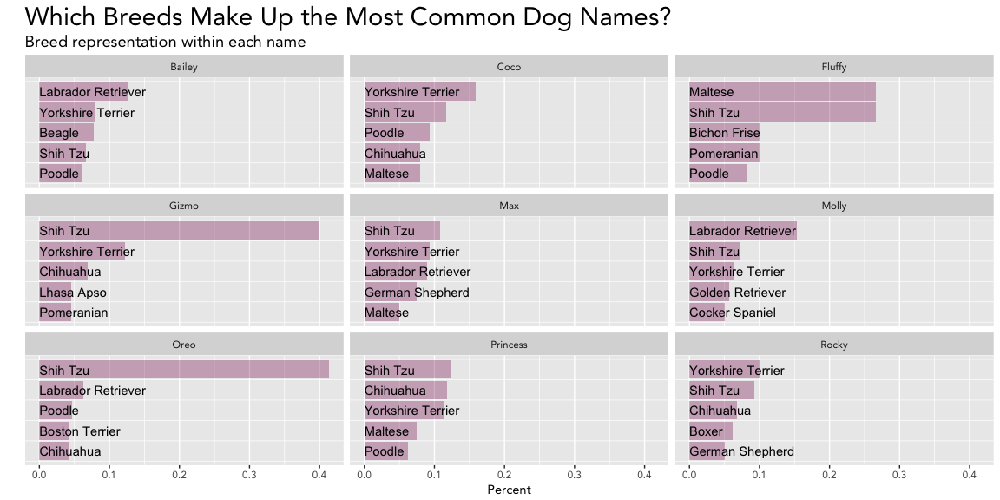

Dog Names
================
Kaylin Pavlik
2018-04-11

Data source: [Dogs of NY](https://fusiontables.google.com/data?docid=1pKcxc8kzJbBVzLu_kgzoAMzqYhZyUhtScXjB0BQ#rows:id=1)

``` r
# load in data set, preprocess
pets <- read.csv("dogs_of_ny.csv", stringsAsFactors=F) %>%
  mutate(breed = gsub("Bull Dog", "Bulldog", breed),
         breed = gsub(" Crossbreed| Mix| Dog| Smooth Coat", "", breed),
         breed = sapply(breed, function(x) strsplit(x, "\\,")[[1]][1]),
         dog_name = capitalize(tolower(dog_name))) %>%
  filter(!breed %in% "Mixed/Other" & !dog_name %in% "N/a")

str(pets)
```

    ## 'data.frame':    55674 obs. of  11 variables:
    ##  $ dog_name          : chr  "Buddy" "Nicole" "Abby" "Chloe" ...
    ##  $ gender            : chr  "M" "F" "F" "F" ...
    ##  $ breed             : chr  "Afghan Hound" "Afghan Hound" "Afghan Hound" "Afghan Hound" ...
    ##  $ birth             : chr  "Jan-00" "Jul-00" "Nov-00" "Jan-02" ...
    ##  $ dominant_color    : chr  "BRINDLE" "BLACK" "BLACK" "WHITE" ...
    ##  $ secondary_color   : chr  "BLACK" "n/a" "TAN" "BLOND" ...
    ##  $ third_color       : chr  "n/a" "n/a" "n/a" "n/a" ...
    ##  $ spayed_or_neutered: chr  "Yes" "Yes" "Yes" "Yes" ...
    ##  $ guard_or_trained  : chr  "No" "No" "No" "No" ...
    ##  $ borough           : chr  "Manhattan" "Manhattan" "Manhattan" "Manhattan" ...
    ##  $ zip_code          : int  10003 10021 10034 10024 10022 10472 10021 10023 11354 10469 ...

#### What are the most common dog breeds? What are the most common names?

``` r
# create base count df
pets_names <- pets %>%
  count(dog_name, breed) 

# create a table of top names and breeds
top_breeds <- data.frame(table(pets$breed)) %>% set_colnames(c("Breed", "Freq")) %>% arrange(desc(Freq))
top_names <- data.frame(table(pets$dog_name)) %>% top_n(1000, Freq) %>% set_colnames(c("Name", "Freq")) %>% arrange(desc(Freq))
kable(cbind(Rank=1:5, top_breeds[1:5,], Rank=1:5, top_names[1:5,]))
```

|  Rank| Breed              |  Freq|  Rank| Name  |  Freq|
|-----:|:-------------------|-----:|-----:|:------|-----:|
|     1| Yorkshire Terrier  |  4607|     1| Max   |   741|
|     2| Shih Tzu           |  4508|     2| Bella |   561|
|     3| Labrador Retriever |  4243|     3| Rocky |   520|
|     4| Chihuahua          |  3389|     4| Coco  |   504|
|     5| Poodle             |  2752|     5| Lucky |   504|

#### What are the most characteristic names for each breed?

``` r
# get tf-idf for dog names by breed
pets_names_tf <- pets_names %>%
  bind_tf_idf(term = dog_name, document = breed, n) %>%
  subset(tf_idf > 0 & n >= 5) %>%
  group_by(breed) %>%
  arrange(desc(tf_idf)) %>%
  mutate(n1 = 1,
         rank = 1:length(n1),
         max = max(rank)) %>%
  ungroup() 

# plot the top 5 names by tf-idf score for each breed
pets_names_tf %>% 
  subset(rank <=5 & max>=5) %>% 
  ggplot(aes(rank, tf_idf)) + 
  geom_bar(stat="identity", fill="maroon4", alpha=0.33) + 
  geom_text(aes(label=dog_name, x=rank), color="black", y=0,hjust=0) +
  scale_x_reverse() + coord_flip() + facet_wrap(~breed, ncol = 3) +
  labs(title="Most Likely Dog Names by Breed", 
       subtitle = "TF-IDF score for names (terms) within breeds (documents)",
       y="TF-IDF", x="") +
  theme(axis.ticks.y=element_blank(), axis.text.y=element_blank()) 
```


#### Which breeds make up the most common dog names?

``` r
# get the breakdown by breed of names 
pets_names_repeats <- pets_names %>% 
  group_by(dog_name) %>%
  mutate(total = sum(n),
         percent = n/sum(n)) %>%
  arrange(desc(percent)) %>%
  mutate(rank = 1:length(n)) %>%
  ungroup()

# subset down to just names of interest (those repeated in tf-idf results)
repeated_tf <- data.frame(table(pets_names_tf$dog_name[pets_names_tf$rank <= 5 & pets_names_tf$max>=5])) %>%
  top_n(9, Freq)
pets_names_repeats <- pets_names_repeats %>%
  subset(dog_name %in% repeated_tf$Var1 & rank <= 5 & total >= 30 & n > 1)

# plot
pets_names_repeats %>% 
  ggplot(aes(rank, percent)) + geom_bar(stat="identity", fill="maroon4", alpha=0.33) + 
  geom_text(aes(label=breed, x=rank), color="black", y=0,hjust=0) +
  facet_wrap(~dog_name, ncol=3) + coord_flip() + scale_x_reverse() +
  labs(title="Which Breeds Make Up the Most Common Dog Names?", 
       subtitle="Breed representation within each name",
       x="", y="Percent") +
  theme(axis.ticks.y=element_blank(), axis.text.y=element_blank()) 
```



#### Which dog breeds have the "least creative" names?

``` r
pets_creative <- pets_names %>%
  group_by(breed) %>%
  arrange(desc(n)) %>%
  mutate(percent = n/sum(n),
         rank = 1:length(n)) %>%
  ungroup() %>%
  subset(breed %in% top_breeds$Breed[top_breeds$Freq>500])

pets_creative_unique <- aggregate(percent ~ breed, pets_creative[pets_creative$n == 1,], sum) %>%
  arrange(desc(percent)) %>%
  mutate(breed = factor(breed, levels=breed))

pets_creative_unique %>% 
  ggplot(aes(breed, percent)) + geom_bar(stat="identity", fill="maroon4", alpha=0.75) + coord_flip() +
  labs(title = "Dog Breeds With the Least Unique Names",
       subtitle = "Share of names appearing only once for a given breed", x = "", y = "% Names Appearing Only Once") +
  theme(plot.title = element_text(size = rel(1.25)), plot.subtitle = element_text(size = rel(1)))
```


``` r
pet_cluster <- pets_names %>%
  subset(breed %in% top_breeds$Breed[top_breeds$Freq>150]) %>%
  group_by(breed) %>%
  mutate(percent = n/sum(n)) %>%
  ungroup() %>%
  filter(dog_name %in% top_names$Name & breed %in% top_breeds$Breed) %>%
  dcast(dog_name ~ breed, value.var="percent") 

pet_cluster[is.na(pet_cluster)] <- 0
pet_cor <- cor(pet_cluster[,-1])
pet_dist <- dist(pet_cor, method="euclidean")
fit <- hclust(pet_dist, method="ward.D")

plot(fit, main="Which Dog Breeds Are Given Similar Names?", family="Avenir")
```


